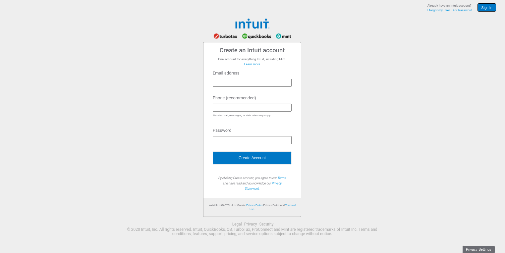

# Sign Up Form

#### A clone of [mint sign up form.](https://accounts.intuit.com/signup.html?offering_id=Intuit.ifs.mint&namespace_id=50000026&redirect_url=https%3A%2F%2Fmint.intuit.com%2Foverview.event%3Futm_medium%3Ddirect%26cta%3Dhero_sign_up_free_ProspectWeb%26ivid%3D3f6b3bf1-3fae-4f14-85de-eeecd5d7f62e%26adobe_mc%3DMCMID%253D23266114906341318024190673831356883930%257CMCORGID%253D969430F0543F253D0A4C98C6%252540AdobeOrg%257CTS%253D1585842406%26ivid%3D3f6b3bf1-3fae-4f14-85de-eeecd5d7f62e%26ivid%3Dbb53a258-2e93-4a68-85c3-dd8bae7b44af)

## Live Demo
[Sign Up Form](https://meronokbay.github.io/signup-form/)

## Built With

- HTML
- CSS

## Authors

👤 **Meron Ogbai**

- Github: [@meronokbay](https://github.com/meronokbay)
- Twitter: [@MeronDev](https://twitter.com/MeronDev)
- Linkedin: [linkedin](https://linkedin.com/in/meron-ogbai-467414198/)

👤 **Ahmet Bozaci**

- Github: [@ahmetbozaci](https://github.com/ahmetbozaci)
- Twitter: [@ahmtbozaci](https://twitter.com/ahmtbozaci)
- Linkedin: [@ahmetbozaci](https://linkedin.com/in/ahmetbozaci)

## 🤝 Contributing

Contributions, issues and feature requests are welcome!

Feel free to check the [issues page](../../issues/).

## Show your support

Give a ⭐️ if you like this project!
